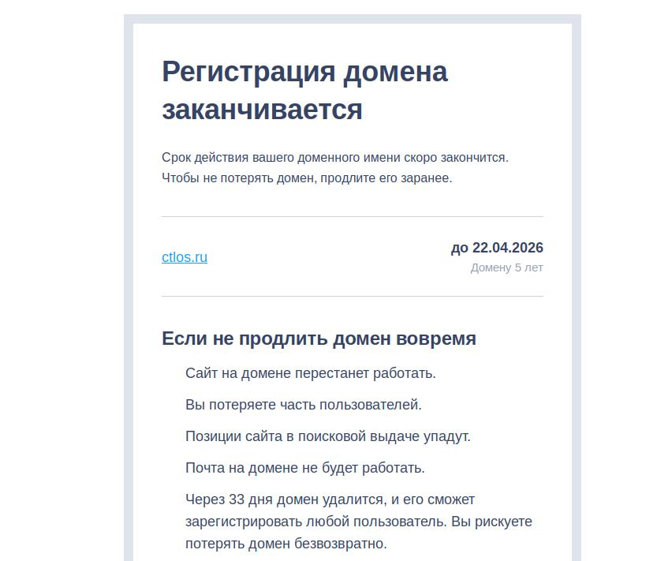

Кастомизированы и приведены в порядок DE. Plasma и gnome в который добавлено расширение `dash-to-panel`. В wm-ах добавлен основным терминалом `alacritty`, проработан дизайн и поведение `polybar`.

Подготовлено небольшое описание для [i3-gaps](/wiki/wm/i3wm/).

В установщик online добавлено множество различного софта и cli утилит для выбора во время установки.

## Добавлено:

- В `/etc/systemd/journald.conf.d/volatile-storage.conf` добавлено ограничение на размер журналирования `SystemMaxUse=50M`.
- NTP серверы `/etc/systemd/timesyncd.conf.d/10-timesyncd.conf`
- Конфиг `/etc/systemd/zram-generator.conf`, статус `systemctl status systemd-zram-setup@zram0`, подробнее об этом [https://wiki.archlinux.org/title/Zram#Using_zram-generator](https://wiki.archlinux.org/title/Zram#Using_zram-generator)
- Многопоток `/etc/xdg/reflector/reflector.conf`, флаг `--threads 5` и не забывайте о ручном скрипте `~/.bin/mirrors`
- Консольгый сис монитор `bottom`, запускается как `btm`
- Во время установки онлайн добавляется репозиторий `archlinuxcn` в котором доступен дополнительный софт из aur, например `onlyoffice` и др. Обеспечивает доп. доступность, если не нужен просто закомментируйте его или удалить из `sudo nano /etc/pacman.conf` и `sudo pacman -Syy`
- Шрифт `ttf-jetbrains-mono-nerd`
- `fastfetch`
- Скрипт `~/.bin/updated-pkgs.sh` выводит дату и время последнего обновления пакетов Вами

> Прошу по возможности оказать поддержку путем доната, желательно на Ю.Мани [yoomoney.ru/transfer](https://yoomoney.ru/transfer): `410011749909586`, еще способы [/donat/](/donat/). **Цена вопроса ~ 1 500 р**

## Исходники

- [v2.5.0](https://github.com/ctlos/ctlosiso/releases/tag/v2.5.0).
