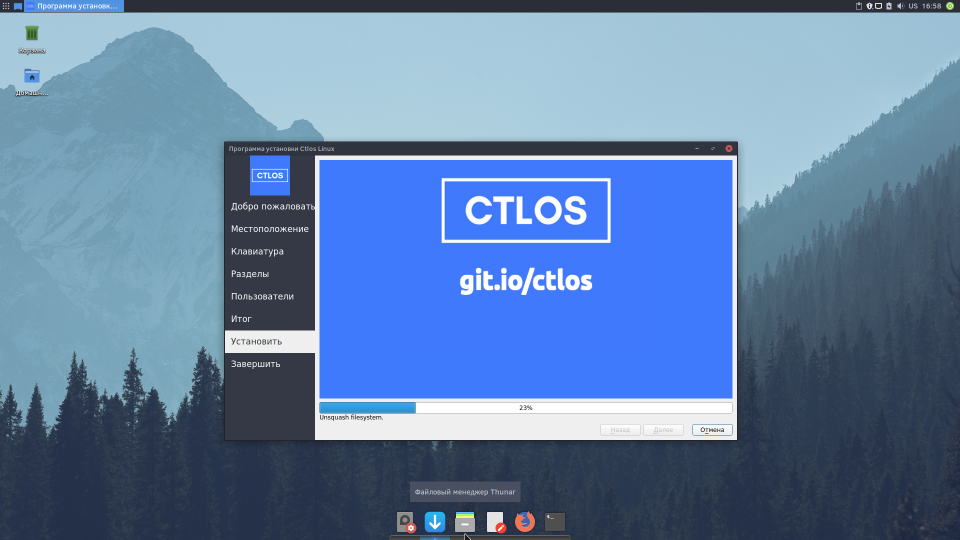

> Перед установкой online обязательно настройте интернет и выполните в терминале команду `mirrors`, а затем запустите установщик online. Команда просто перестроит список зеркал и обновит базы pacman, что предоставит наилучшую скорость установки для вас.

> Если установка online вылетает с ошибкой `stemd-machine-id-setup error 127`, то закройте установщик, откройте терминал выполните как писал выше `mirrors` и затем обновите пакет `yay -Syy archlinux-keyring`. После этого запускайте установку online.

## Запись ISO

Для записи образа на USB накопитель потребуется установочный ISO образ, который можно скачать по ссылке [Скачать Ctlos Linux](/get).

> Перед началом записи образа, отформатируйте USB накопитель в FAT32, например, используя gparted. Проверьте контрольные суммы.

## Проверка ISO образа

Файлы с контрольными суммами всегда находятся рядом с iso, в [зеркалах загрузки](/get) и содержат хеш, который и нужно сравнить.

Проверка контрольных сумм в Windows.

Чтобы проверить контрольные суммы в Windows используйте следующую утилиту [MD5 & SHA Checksum Utility](http://raylin.wordpress.com/downloads/md5-sha-1-checksum-utility/).

Проверка контрольных сумм в Linux.

Проверка SHA256.

```bash
sha256sum ctlos_xfce_1.0.0_20181102.iso
```

GPG, если рядом есть `.sig`.

```bash
sudo pacman -S gnupg
```

Импорт ключа и проверка образа.

```bash
gpg --keyserver keys.gnupg.net --recv-keys 98F76D97B786E6A3
gpg --verify ctlos_xfce_1.0.0_20181102.iso.sig ctlos_xfce_1.0.0_20181102.iso
```

Подробнее о [GnuPG](/wiki/other/gnupg).

## Программы для записи

Для записи образа в **Linux** потребуется для начала отформатировать Ваш USB накопитель. Сделать это можно следующей командой.

```bash
sudo mkfs.fat -F32 /dev/sdX
```

Далее записываем скачанный ранее образ используя утилиту **dd**.

```bash
sudo dd bs=4M if=ctlos.iso of=/dev/sdX status=progress && sync
```

Кросплатформенные инструменты для записи образов (Linux, Windows).

- [Ventoy](https://forum.ctlos.ru/t/ventoy-multi-iso-usb/75)
- [Etcher](https://etcher.io/)

Для записи образа в **Windows** рекомендуется использовать программу Ventoy или [Rufus](https://rufus.akeo.ie/).

> При записи образа в программе Rufus выбирайте режим записи ISO в dd.

## Установка

После успешной записи образа и его загрузки на Вашем устройстве Вы увидите в самом начале раздел выбора языка интерфейса. Выбирайте тот, который Вам удобен. В данном примере будет использоваться русский язык.

> Если вы используете образ с xfce, то у вас присутствует выбор метода установки.

- Online: открывается раздел выбора других окружений и доп. программ, обязательно требуется включенный интернет.
- Offline: произойдет установка того, что вы видите в текущий момент, простая распаковка, интернет не нужен.


На следующем шаге Вам требуется указать Ваше примерное местоположение для установки и выбора временной зоны.


> Раскладка **ru,us** по **alt+shift**.


После выбора раскладки Вам требуется разметить диск вручную либо оставить всё как есть.


После завершения переразметки диска Вам нужно создать пользователя, выбрать желаемый пароль.


Проверяем данные, можно вернуться и исправить, если что-то не так. Если всё верно - нажимайте "**Установить**".


Дождитесь конца установки.



Готово! Теперь Вы можете перезагрузить Ваше устройство.


Выбор в меню GRUB.


Менеджер входа (используется LightDm), в правом верхнем углу можно выбрать сессию, если присутствуют другие Окружения (DE), или Оконные менеджеры (WM). На данном скриншоте XFCE, она единственная и по умолчанию ничего можно не выбирать.


Вот и все! Отдельная благодарность за скриншоты пользователю **breadandbutter** с nnm-club.me


